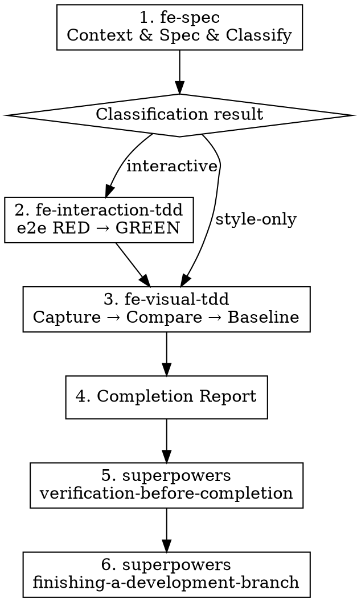

# Frontend Harness — Orchestrator

Orchestrates the full flow for frontend UI work.
Each step is an independent skill; this orchestrator invokes them in order.

## Execution Flow

### Step 1. Invoke fe-spec

Invoke `fe-spec` via the Skill tool. Receive the spec and classification result.

- Figma URL present → Figma mode
- Code path only → Code mode
- Follow all STOP gates defined by fe-spec

### Step 2. Branch by Classification

| Classification | Path |
|----------------|------|
| **style-only** | Invoke fe-visual-tdd only (skip to Step 3) |
| **interactive** | Invoke fe-interaction-tdd, then fe-visual-tdd |

### Step 2-a. Invoke fe-interaction-tdd (interactive only)

Invoke `fe-interaction-tdd` via the Skill tool. Pass the interaction spec from fe-spec.

- Follow all STOP gates defined by fe-interaction-tdd
- Wait until GREEN is confirmed

### Step 3. Invoke fe-visual-tdd

Invoke `fe-visual-tdd` via the Skill tool.

- Figma nodeId present → Figma mode
- No nodeId → Baseline mode
- Follow all STOP gates defined by fe-visual-tdd

### Step 4. Completion Report

Refer to [references/completion-guide.md](references/completion-guide.md) to report artifacts and regression setup.

### Step 5. superpowers verification-before-completion

Invoke `superpowers:verification-before-completion` via the Skill tool.

- Verify full test suite passes
- Verify lint/typecheck passes
- Verify build succeeds

### Step 6. superpowers finishing-a-development-branch

Invoke `superpowers:finishing-a-development-branch` via the Skill tool.

- Present commit/PR/merge options

## ABSOLUTE RULES

1. **Never skip skill order.** fe-spec → (fe-interaction-tdd →) fe-visual-tdd → verification → finishing.
2. **Respect each sub-skill's STOP gates.** The orchestrator must not override or bypass a sub-skill's STOP.
3. **Follow the exact path for the classification result.** Never skip fe-interaction-tdd when classification is interactive.

### Rationalization Table — If you think this, STOP

| If you think… | What you must do |
|----------------|-----------------|
| "This is a simple change, skip spec and jump to implementation" | Start with fe-spec. Always. |
| "Tests already exist, skip fe-interaction-tdd" | If classified as interactive, it must run. |
| "Visual verification can wait until later" | fe-visual-tdd must complete before the completion report. |
| "Verification isn't really necessary" | superpowers verification checks overall project health. Always run it. |

## Checklist

- [ ] Invoke fe-spec → obtain spec + classification
- [ ] Select correct path based on classification
- [ ] (interactive) Invoke fe-interaction-tdd → obtain GREEN
- [ ] Invoke fe-visual-tdd → obtain baseline
- [ ] Output completion report
- [ ] Invoke superpowers verification-before-completion
- [ ] Invoke superpowers finishing-a-development-branch
