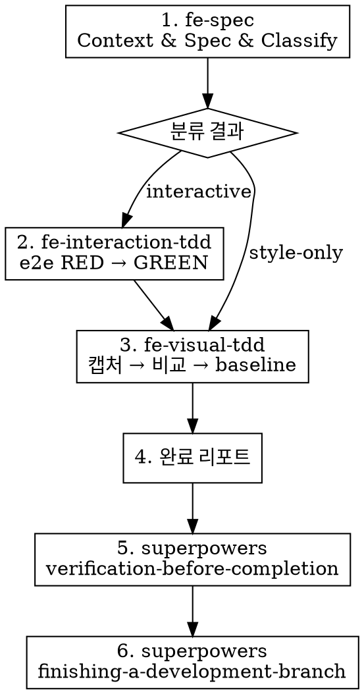

# Frontend Harness — Orchestrator

프론트엔드 UI 작업의 풀 플로우를 오케스트레이션한다.
각 단계는 독립 스킬로 분리되어 있으며, 이 스킬이 순서대로 호출한다.

## 실행 흐름

### Step 1. fe-spec 호출

Skill 도구로 `fe-spec`을 호출한다. spec과 분류 결과를 받는다.

- Figma URL이 있으면 Figma 모드
- 코드 경로만 있으면 Code 모드
- fe-spec의 모든 STOP 게이트를 따른다

### Step 2. 분류에 따른 분기

| 분류 | 경로 |
|------|------|
| **style-only** | fe-visual-tdd만 호출 (Step 3으로) |
| **interactive** | fe-interaction-tdd 호출 후 fe-visual-tdd 호출 |

### Step 2-a. fe-interaction-tdd 호출 (interactive인 경우)

Skill 도구로 `fe-interaction-tdd`를 호출한다. fe-spec의 interaction spec을 전달한다.

- fe-interaction-tdd의 모든 STOP 게이트를 따른다
- GREEN 확인까지 대기

### Step 3. fe-visual-tdd 호출

Skill 도구로 `fe-visual-tdd`를 호출한다.

- Figma nodeId가 있으면 Figma 모드
- 없으면 Baseline 모드
- fe-visual-tdd의 모든 STOP 게이트를 따른다

### Step 4. 완료 리포트

[references/completion-guide.md](references/completion-guide.md)를 참조하여 아티팩트 목록과 regression 설정을 리포트한다.

### Step 5. superpowers verification-before-completion

Skill 도구로 `superpowers:verification-before-completion`을 호출한다.

- 전체 테스트 스위트 통과 확인
- 린트/타입체크 확인
- 빌드 확인

### Step 6. superpowers finishing-a-development-branch

Skill 도구로 `superpowers:finishing-a-development-branch`를 호출한다.

- 커밋/PR/머지 옵션 제시

## ABSOLUTE RULES

1. **스킬 순서를 건너뛰지 않는다.** fe-spec → (fe-interaction-tdd →) fe-visual-tdd → verification → finishing.
2. **각 하위 스킬의 STOP 게이트를 존중한다.** 오케스트레이터가 하위 스킬의 STOP을 무시하고 진행하지 않는다.
3. **분류 결과에 따라 정확한 경로를 따른다.** interactive인데 fe-interaction-tdd를 건너뛰지 않는다.

### Rationalization Table — 이 생각이 들면 STOP

| 이런 생각이 들면 | 실제로 해야 할 것 |
|-----------------|------------------|
| "간단한 변경이니 spec 없이 바로 구현하자" | fe-spec부터 시작한다. 항상. |
| "이미 테스트가 있으니 fe-interaction-tdd는 건너뛰자" | 분류가 interactive면 반드시 실행한다. |
| "visual 확인은 나중에 하자" | fe-visual-tdd까지 완료해야 리포트를 작성할 수 있다. |
| "verification은 굳이 안 해도 되겠다" | superpowers verification은 프로젝트 전체 건강도 확인이다. 반드시 실행. |

## Checklist

- [ ] fe-spec 호출 → spec + 분류 결과 확보
- [ ] 분류에 따른 올바른 경로 선택
- [ ] (interactive) fe-interaction-tdd 호출 → GREEN 확보
- [ ] fe-visual-tdd 호출 → baseline 확보
- [ ] 완료 리포트 출력
- [ ] superpowers verification-before-completion 호출
- [ ] superpowers finishing-a-development-branch 호출
