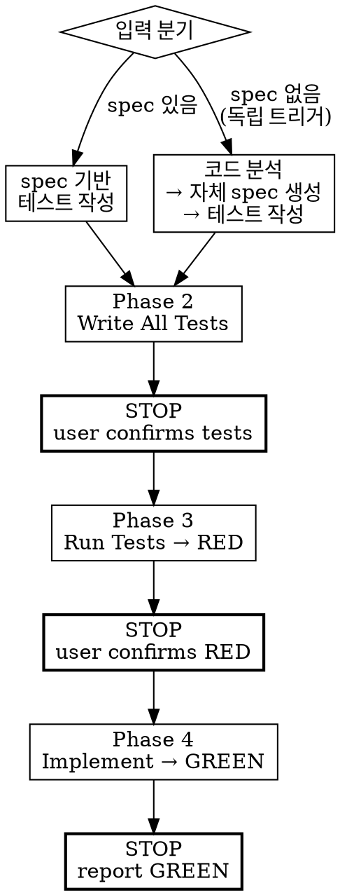

# Frontend Interaction TDD

Playwright e2e 테스트를 먼저 작성 → RED 확인 → 구현 → GREEN.



## ABSOLUTE RULES

1. **RED 확인 전 구현 코드를 절대 작성하지 않는다.**
   - 컴포넌트 파일, 페이지 파일, 스타일 파일, 라우트 파일, 레이아웃 파일 금지.
   - RED 확인 전 허용되는 코드는 **테스트 코드** (`.spec.ts`)와
     **테스트 인프라** (`/dev/preview` 래퍼)뿐이다.
   - `.tsx`, `.vue`, `.svelte`, 스타일 파일을 Phase 3 전에 만들었다면
     규칙 위반이다. 즉시 삭제하라.

2. **각 Phase는 STOP으로 끝난다.** 결과를 user에게 제시하고
   명시적 확인을 받은 후에만 다음 Phase로 이동한다.

3. **한 Phase = 한 작업.** 여러 Phase의 작업을 하나로 합치지 않는다.
   Phase 2는 테스트 작성. Phase 3은 실행. Phase 4는 구현.
   세 개의 별도 단계이며, 사이에 두 개의 확인 게이트가 있다.

### Rationalization Table — 이 생각이 들면 STOP

| 이런 생각이 들면 | 실제로 해야 할 것 |
|-----------------|------------------|
| "이건 간단해서 테스트 안 해도 돼" | 모든 interactive 작업은 테스트가 필수다. |
| "전체 페이지라서 테스트하기 어렵다" | 페이지 라우트 URL로 테스트한다. |
| "인터랙션이 너무 많아서 전부 테스트는 힘들다" | 전부 테스트를 작성한다. 그게 이 스킬의 목적이다. |
| "시간이 너무 오래 걸린다" | Interaction TDD는 필수 프로세스이지, 선택이 아니다. |
| "테스트와 구현을 같이 하면 효율적이다" | Phase 2 = 테스트만. Phase 4 = 구현만. 절대 합치지 않는다. |
| "/dev/preview 라우트는 필요없다" | 컴포넌트 작업이 아닌 경우만 해당. 페이지/플로우는 실제 라우트를 쓴다. |

## Setup

프로젝트에 Playwright가 없으면 설치한다:

```bash
npm install -D playwright pixelmatch pngjs tsx
npx playwright install chromium --with-deps
```

## 입력 모드

| 모드 | 입력 | 동작 |
|------|------|------|
| **Spec 있음** | fe-spec 또는 brainstorming의 interaction spec | spec 기반으로 바로 테스트 작성 |
| **Spec 없음** | 파일 경로 또는 컴포넌트 이름 (독립 트리거) | 코드 분석 → 자체 spec 생성 → 테스트 작성 |

독립 트리거 시에도 동일한 STOP 게이트를 적용한다.

---

## Phase 2 — Write All Tests

> **이 Phase는 테스트 코드만 작성한다. 구현 코드는 어떤 종류도 금지.**

### Prerequisites

미설정 시: `playwright.config.ts` (프로젝트 루트), `e2e/` 디렉토리.
컴포넌트 작업이면 `/dev/preview?component=<Name>` 라우트를 생성한다 (dev-only 가드, auth 레이아웃 밖).
[references/test-setup-guide.md](references/test-setup-guide.md)에서 상세 설정을 확인한다.

**CRITICAL:** Preview는 실제 프로덕션 컴포넌트를 import해야 한다 — 마크업 복사 금지.
[references/preview-guide.md](references/preview-guide.md)에서 구성 규칙을 확인한다.

### Test base URL

| Task type | Base URL |
|-----------|----------|
| Component | `/dev/preview?component=<ComponentName>` |
| Page | 실제 페이지 라우트 (예: `/users`) |
| Flow | 플로우 시작 페이지 라우트 |

### Step 1. Playwright 테스트 전부 작성

`e2e/<task>.spec.ts`에 **모든** spec 항목의 테스트를 한 번에 작성한다.

- 위 표의 올바른 base URL 사용
- spec 항목당 하나의 `test()`
- role 기반 셀렉터 우선 (`getByRole`, `getByLabel`)

### Step 2. API 모킹 처리

API 호출이 있으면: MSW (package.json에 있으면) 또는 `page.route()` 인라인.
목 데이터는 `e2e/mocks/`에 넣는다. 엔드포인트나 응답 형태를 모르면 → user에게 질문.
[references/mock-troubleshooting.md](references/mock-troubleshooting.md)에서 결정 트리와 일반 수정법을 확인한다.

### Phase 2 output

이 Phase에서 생성하는 파일:
- `e2e/<task>.spec.ts` (테스트 파일)
- `e2e/mocks/*.json` (목 데이터, 필요 시)
- `dev/preview/<Component>.preview.tsx` (테스트 인프라, 컴포넌트 작업만)

<HARD-GATE>
구현 파일(컴포넌트, 페이지, 스타일, 라우트, 레이아웃)을 만들었다면 규칙 위반이다. 즉시 삭제하라.
</HARD-GATE>

### >>> STOP — User에게 제시하고 대기 <<<

> "Phase 2 완료. `e2e/<task>.spec.ts`에 N개 테스트를 작성했습니다. 실행해서 RED를 확인할까요?"

**테스트를 아직 실행하지 않는다. User 확인 전까지 Phase 3으로 진행하지 않는다.**

---

## Phase 3 — Confirm RED

> **이 Phase는 테스트를 실행하고 실패를 확인하는 것만 한다. 구현 코드 없음.**

### Step 1. 테스트 실행

```bash
npx playwright test e2e/<task>.spec.ts
```

### Step 2. RED 확인

모든 테스트가 실패해야 한다. 예상치 않게 통과하는 테스트가 있으면 조사한다.

- [ ] `npx playwright test e2e/<task>.spec.ts` 실행 완료
- [ ] 모든 테스트 FAIL (RED 확인)
- [ ] 환경 문제로 테스트 실행 불가 시, 환경을 먼저 수정

### >>> STOP — User에게 제시하고 대기 <<<

> "Phase 3 완료. N개 테스트 전부 RED (예상대로 실패). 구현을 시작할까요?"

<HARD-GATE>
User가 확인하기 전까지 구현 코드를 작성하지 않는다. Phase 4와 합치지 않는다.
</HARD-GATE>

---

## Phase 4 — Implement to GREEN

> **이제 구현 코드를 작성해도 된다.** Phase 3 RED 확인 후에만.

### Step 1. 구현

컴포넌트/페이지/플로우를 구현한다. 의미 있는 변경마다 테스트를 실행한다.

```bash
npx playwright test e2e/<task>.spec.ts
```

### Step 2. Progress tracking — stall counter

```
테스트 실행 후:
  통과 테스트 수가 증가했는가?
    ├── Yes → 계속 (progress)
    └── No  → stall counter +1

Stall counter가 3에 도달 → 중단하고 user에게 escalate:
  "N/M 테스트 통과 중. 막힌 테스트: [실패 테스트명]. 가이드가 필요합니다."
```

### Step 3. GREEN 확인

- [ ] `npx playwright test e2e/<task>.spec.ts` 실행 완료
- [ ] 모든 테스트 PASS (GREEN 확인 — 0 failures)
- [ ] 실패하는 테스트가 있으면 구현을 먼저 수정

### >>> STOP — GREEN 리포트 <<<

> "Phase 4 완료 — Interaction TDD 종료. N개 테스트 전부 GREEN."

## Gotchas

- **Preview ≠ Production.** 마크업 복제는 visual TDD가 사본을 검증하게 만든다.
  [references/preview-guide.md](references/preview-guide.md) 참조.
- **Stall counter = 3.** 통과 테스트 수가 3회 연속 증가하지 않으면 중단하고 escalate.

## Checklist

- [ ] Prerequisites 확인 (playwright.config.ts, e2e/, preview route)
- [ ] API 모킹 전략 결정 (MSW / page.route / none)
- [ ] 모든 테스트 작성 — **STOP, user 확인 대기**
- [ ] 테스트 실행, 전부 RED 확인 — **STOP, user 확인 대기**
- [ ] 구현 완료, 전부 GREEN 확인 — **STOP, user에게 리포트**
