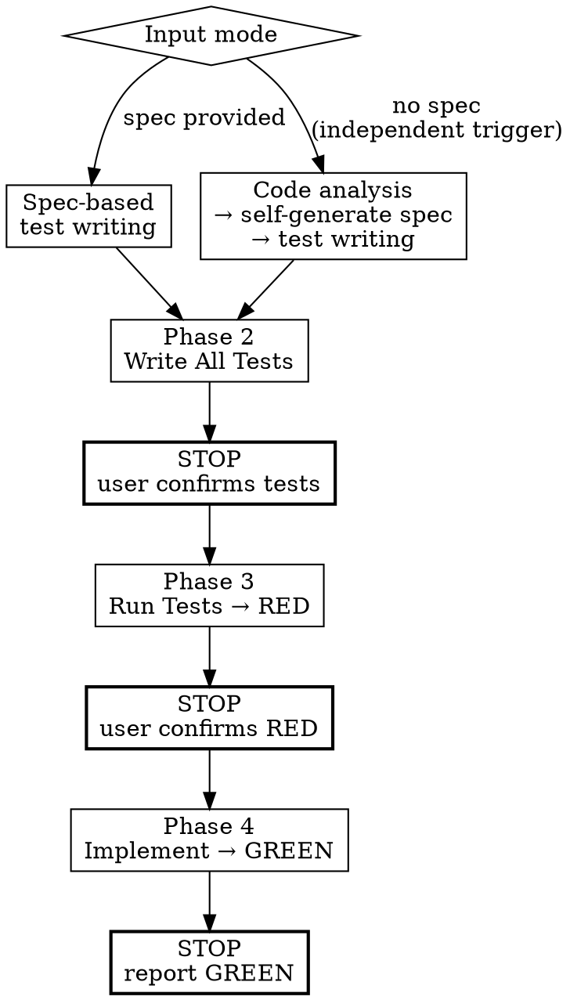

# Frontend Interaction TDD

Write Playwright e2e tests first → confirm RED → implement → GREEN.



## ABSOLUTE RULES

1. **Never write implementation code before confirming RED.**
   - No component files, page files, style files, route files, layout files.
   - The only code allowed before RED confirmation is **test code** (`.spec.ts`) and
     **test infrastructure** (`/dev/preview` wrappers).
   - If you created `.tsx`, `.vue`, `.svelte`, or style files before Phase 3,
     that is a rule violation. Delete them immediately.

2. **Each Phase ends with STOP.** Present results to the user and
   get explicit confirmation before moving to the next Phase.

3. **One Phase = one task.** Do not combine work from multiple Phases.
   Phase 2 is test writing. Phase 3 is running. Phase 4 is implementation.
   Three separate steps with two confirmation gates between them.

### Rationalization Table — If you think this, STOP

| If you think… | What you must do |
|----------------|-----------------|
| "This is too simple to need tests" | All interactive work requires tests. |
| "It's a full page, hard to test" | Test via the page route URL. |
| "Too many interactions to test all of them" | Write tests for all of them. That's this skill's purpose. |
| "This is taking too long" | Interaction TDD is a required process, not optional. |
| "Writing tests and implementation together is more efficient" | Phase 2 = tests only. Phase 4 = implementation only. Never combine. |
| "/dev/preview route isn't needed" | Only true for non-component tasks. Pages/flows use their actual route. |

## Setup

If the project doesn't have Playwright, install it:

```bash
npm install -D playwright pixelmatch pngjs tsx
npx playwright install chromium --with-deps
```

## Input Modes

| Mode | Input | Action |
|------|-------|--------|
| **Spec provided** | Interaction spec from fe-spec or brainstorming | Write tests directly from spec |
| **No spec** | File path or component name (independent trigger) | Analyze code → self-generate spec → write tests |

The same STOP gates apply even when triggered independently.

---

## Phase 2 — Write All Tests

> **This Phase writes test code only. No implementation code of any kind.**

### Prerequisites

If not set up: `playwright.config.ts` (project root), `e2e/` directory.
For component tasks, create a `/dev/preview?component=<Name>` route (dev-only guard, outside auth layout).
See [references/test-setup-guide.md](references/test-setup-guide.md) for detailed setup.

**CRITICAL:** Preview must import the actual production component — never copy markup.
See [references/preview-guide.md](references/preview-guide.md) for construction rules.

### Test base URL

| Task type | Base URL |
|-----------|----------|
| Component | `/dev/preview?component=<ComponentName>` |
| Page | Actual page route (e.g., `/users`) |
| Flow | Flow start page route |

### Step 1. Write all Playwright tests

Write **all** spec items as tests in `e2e/<task>.spec.ts` at once.

- Use the correct base URL from the table above
- One `test()` per spec item
- Prefer role-based selectors (`getByRole`, `getByLabel`)

### Step 2. Handle API mocking

If there are API calls: use MSW (if in package.json) or `page.route()` inline.
Put mock data in `e2e/mocks/`. If endpoints or response shapes are unknown → ask the user.
See [references/mock-troubleshooting.md](references/mock-troubleshooting.md) for the decision tree and common fixes.

### Phase 2 output

Files created in this Phase:
- `e2e/<task>.spec.ts` (test file)
- `e2e/mocks/*.json` (mock data, if needed)
- `dev/preview/<Component>.preview.tsx` (test infrastructure, component tasks only)

<HARD-GATE>
If you created implementation files (components, pages, styles, routes, layouts), that is a rule violation. Delete them immediately.
</HARD-GATE>

### >>> STOP — Present to user and wait <<<

> "Phase 2 complete. Wrote N tests in `e2e/<task>.spec.ts`. Shall I run them to confirm RED?"

**Do not run tests yet. Do not proceed to Phase 3 until user confirms.**

---

## Phase 3 — Confirm RED

> **This Phase only runs tests and confirms failure. No implementation code.**

### Step 1. Run tests

```bash
npx playwright test e2e/<task>.spec.ts
```

### Step 2. Confirm RED

All tests must fail. Investigate any that pass unexpectedly.

- [ ] `npx playwright test e2e/<task>.spec.ts` executed
- [ ] All tests FAIL (RED confirmed)
- [ ] If tests can't run due to environment issues, fix the environment first

### >>> STOP — Present to user and wait <<<

> "Phase 3 complete. All N tests RED (failed as expected). Shall I start implementation?"

<HARD-GATE>
Do not write implementation code until user confirms. Do not combine with Phase 4.
</HARD-GATE>

---

## Phase 4 — Implement to GREEN

> **Now implementation code is allowed.** Only after Phase 3 RED is confirmed.

### Step 1. Implement

Build the component/page/flow. Run tests after each meaningful change.

```bash
npx playwright test e2e/<task>.spec.ts
```

### Step 2. Progress tracking — stall counter

```
After each test run:
  Did the number of passing tests increase?
    ├── Yes → continue (progress)
    └── No  → stall counter +1

Stall counter reaches 3 → stop and escalate to user:
  "N/M tests passing. Stuck on: [failing test names]. Need guidance."
```

### Step 3. Confirm GREEN

- [ ] `npx playwright test e2e/<task>.spec.ts` executed
- [ ] All tests PASS (GREEN confirmed — 0 failures)
- [ ] If any tests fail, fix the implementation first

### >>> STOP — GREEN report <<<

> "Phase 4 complete — Interaction TDD finished. All N tests GREEN."

## Gotchas

- **Preview ≠ Production.** Copying markup makes visual TDD verify a copy, not the real code.
  See [references/preview-guide.md](references/preview-guide.md).
- **Stall counter = 3.** If passing test count doesn't increase for 3 consecutive runs, stop and escalate.

## Checklist

- [ ] Prerequisites verified (playwright.config.ts, e2e/, preview route)
- [ ] API mocking strategy decided (MSW / page.route / none)
- [ ] All tests written — **STOP, wait for user confirmation**
- [ ] Tests run, all RED confirmed — **STOP, wait for user confirmation**
- [ ] Implementation complete, all GREEN confirmed — **STOP, report to user**
