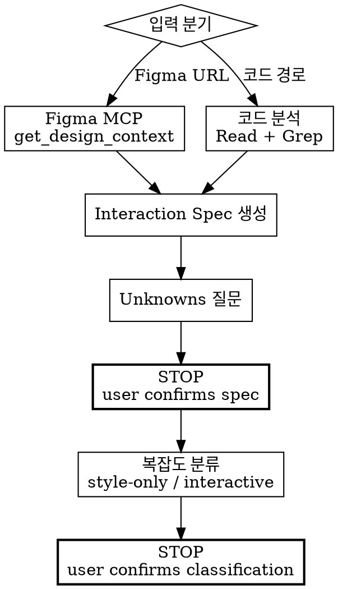

# Frontend Spec — Context & Classification

Figma 디자인 또는 기존 코드에서 컨텍스트를 수집하고, interaction spec을 생성하고, 복잡도를 분류한다.



## ABSOLUTE RULES

1. **Spec 확인 전 다음 단계로 넘어가지 않는다.** user가 spec을 확인하기 전까지 분류(Classification)를 시작하지 않는다.
2. **분류 확인 전 어떤 코드도 작성하지 않는다.** user가 분류를 확인하기 전까지 테스트든 구현이든 어떤 코드도 작성하지 않는다.

## 입력 모드

| 모드 | 입력 | 동작 |
|------|------|------|
| **Figma** | Figma URL (fileKey, nodeId) | Figma MCP `get_design_context` → 디자인 토큰, 구조, 인라인 스크린샷 |
| **Code** | 파일 경로 또는 컴포넌트 이름 | 코드 읽기 → 현재 상태, 인터랙션, 라우팅 파악 |

## Phase 0 — Context & Spec Generation

### Figma 모드

#### Step 1. Figma MCP로 디자인 컨텍스트 수집

```
mcp__figma__get_design_context({ fileKey, nodeId })
→ design tokens, colors, spacing, component structure
→ inline screenshot (conversation reference only — CANNOT be saved to disk)
→ frame width × height (save for visual TDD viewport matching)
```

> **No image download in this phase.** 이미지 다운로드는 fe-visual-tdd에서 한다.
> `fileKey`, `nodeId`, frame dimensions를 저장한다.

#### Step 2. Interaction spec 생성

Figma 디자인 + task description으로 구조화된 spec을 합성한다.
[references/spec-template.md](references/spec-template.md) 템플릿을 따른다.
포함 항목: initial state, interactions, edge cases, API calls, visual reference (fileKey, nodeId, viewport).

### Code 모드

#### Step 1. 코드 분석으로 컨텍스트 수집

```
1. 대상 파일을 Read로 읽는다
2. 관련 컴포넌트/페이지를 Grep으로 탐색한다
3. 라우팅, 상태 관리, API 호출을 파악한다
4. 현재 어떤 인터랙션이 있는지 목록화한다
```

#### Step 2. Interaction spec 생성

현재 코드 상태 기반으로 spec을 합성한다.
[references/spec-template.md](references/spec-template.md) 템플릿을 따른다.
포함 항목: initial state, interactions, edge cases, API calls.
Visual Reference 섹션은 Figma 없이 생략하거나, viewport만 명시한다.

### 공통 — Step 3. Unknowns 질문

다음 경우 user에게 질문한다:
- Figma에 state variants (hover, loading, error)가 없지만 예상되는 경우
- 버튼이 있지만 클릭 후 동작이 불분명한 경우
- API 호출이 예상되지만 성공/실패 처리가 디자인에 없는 경우
- 조건부 렌더링이 있지만 조건이 불분명한 경우

### 공통 — Step 4. User confirms spec

생성된 spec을 제시한다. user가 확인하거나 수정한다.

### >>> STOP — Spec을 제시하고 대기 <<<

> "Phase 0 완료. Interaction spec은 다음과 같습니다: [spec]. 확인 또는 수정해주세요."

<HARD-GATE>
User가 spec을 확인하기 전까지 Phase 1로 진행하지 않는다.
</HARD-GATE>

---

## Phase 1 — Complexity Classification

**구현 전에** 분류한다.

| Complexity | Criteria | Path |
|------------|----------|------|
| **style-only** | 색상, 간격, 폰트, 레이아웃 변경. 새 인터랙션 없음. | fe-visual-tdd만 |
| **interactive** | 새 컴포넌트, 폼, 모달, 네비게이션, 상태 변경. | fe-interaction-tdd → fe-visual-tdd |
| **ambiguous** | 인터랙션 변경 여부 불분명. | user에게 질문 |

**Ambiguous일 때 질문:**
- "이 작업은 스타일만 변경하나요, 인터랙션 변경도 있나요?"
- "기존 동작이 그대로 유지되나요?"

### Rationalization Table — 이 생각이 들면 STOP

| 이런 생각이 들면 | 실제로 해야 할 것 |
|-----------------|------------------|
| "이건 간단한 변경이니까 spec 없이 바로 하자" | spec을 먼저 만들어라. 간단해 보여도 scope이 불분명할 수 있다. |
| "코드를 보면 뭘 해야 할지 알 수 있으니 spec은 필요없다" | 코드를 봐서 알 수 있는 건 현재 상태이지, 목표 상태가 아니다. spec을 만들어라. |
| "분류가 너무 뻔해서 user 확인은 건너뛰자" | 뻔하더라도 반드시 user 확인을 받아라. 잘못된 분류 → 잘못된 전체 경로. |

### >>> STOP — 분류 결과를 제시하고 대기 <<<

> "Phase 1 완료. 이 작업을 [style-only/interactive]로 분류했습니다. 경로: [fe-visual-tdd만 / fe-interaction-tdd → fe-visual-tdd]. 확인해주세요."

<HARD-GATE>
User가 분류를 확인하기 전까지 어떤 코드도 작성하지 않는다.
</HARD-GATE>

## Output

이 스킬의 출력:
1. **Interaction spec** — 구조화된 spec 문서
2. **분류 결과** — `style-only` 또는 `interactive`
3. **저장된 메타데이터** — fileKey, nodeId, viewport dimensions (Figma 모드일 때)

다음 스킬(fe-interaction-tdd 또는 fe-visual-tdd)이 이 출력을 입력으로 받는다.

## Checklist

- [ ] 디자인 컨텍스트 수집 완료 (Figma MCP 또는 코드 분석)
- [ ] fileKey, nodeId, viewport dimensions 저장 (Figma 모드)
- [ ] Interaction spec 생성 — **STOP, user 확인 대기**
- [ ] 복잡도 분류 (style-only / interactive / ambiguous → 질문) — **STOP, user 확인 대기**
