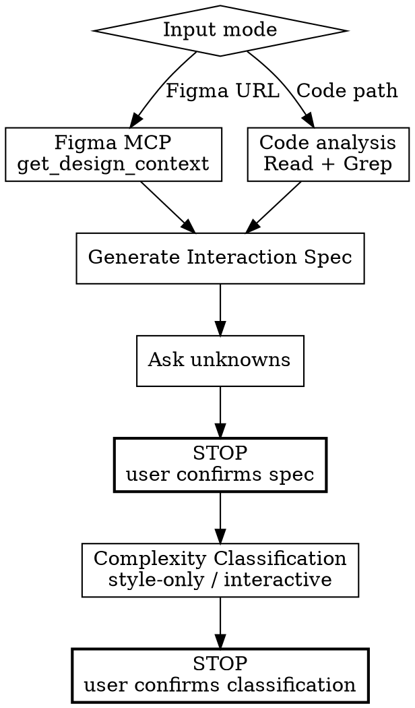

# Frontend Spec — Context & Classification

Collect context from Figma design or existing code, generate an interaction spec, and classify complexity.



## ABSOLUTE RULES

1. **Do not proceed past spec confirmation.** Do not start classification until the user confirms the spec.
2. **Do not write any code before classification is confirmed.** No test code, no implementation code — nothing until the user confirms the classification.

## Input Modes

| Mode | Input | Action |
|------|-------|--------|
| **Figma** | Figma URL (fileKey, nodeId) | Figma MCP `get_design_context` → design tokens, structure, inline screenshot |
| **Code** | File path or component name | Read code → identify current state, interactions, routing |

## Phase 0 — Context & Spec Generation

### Figma Mode

#### Step 1. Collect design context via Figma MCP

```
mcp__figma__get_design_context({ fileKey, nodeId })
→ design tokens, colors, spacing, component structure
→ inline screenshot (conversation reference only — CANNOT be saved to disk)
→ frame width × height (save for visual TDD viewport matching)
```

> **No image download in this phase.** Image downloads happen in fe-visual-tdd.
> Save `fileKey`, `nodeId`, and frame dimensions.

#### Step 2. Generate interaction spec

Synthesize a structured spec from the Figma design + task description.
Follow the [references/spec-template.md](references/spec-template.md) template.
Include: initial state, interactions, edge cases, API calls, visual reference (fileKey, nodeId, viewport).

### Code Mode

#### Step 1. Collect context via code analysis

```
1. Read the target files
2. Search for related components/pages with Grep
3. Identify routing, state management, API calls
4. List current interactions
```

#### Step 2. Generate interaction spec

Synthesize a spec based on the current code state.
Follow the [references/spec-template.md](references/spec-template.md) template.
Include: initial state, interactions, edge cases, API calls.
Visual Reference section can be omitted or limited to viewport only when there is no Figma.

### Common — Step 3. Ask unknowns

Ask the user when:
- Figma is missing state variants (hover, loading, error) that are expected
- A button exists but the post-click behavior is unclear
- API calls are expected but success/failure handling is not in the design
- Conditional rendering exists but conditions are unclear

### Common — Step 4. User confirms spec

Present the generated spec. The user confirms or requests revisions.

### >>> STOP — Present spec and wait <<<

> "Phase 0 complete. Here is the interaction spec: [spec]. Please confirm or request changes."

<HARD-GATE>
Do not proceed to Phase 1 until the user confirms the spec.
</HARD-GATE>

---

## Phase 1 — Complexity Classification

Classify **before** any implementation.

| Complexity | Criteria | Path |
|------------|----------|------|
| **style-only** | Color, spacing, font, layout changes only. No new interactions. | fe-visual-tdd only |
| **interactive** | New components, forms, modals, navigation, state changes. | fe-interaction-tdd → fe-visual-tdd |
| **ambiguous** | Unclear whether interactions change. | Ask the user |

**When ambiguous, ask:**
- "Does this task change only styles, or does it also change interactions?"
- "Does existing behavior remain unchanged?"

### Rationalization Table — If you think this, STOP

| If you think… | What you must do |
|----------------|-----------------|
| "This is a simple change, skip the spec" | Create the spec first. Even simple-looking tasks can have unclear scope. |
| "I can tell what to do from the code, no spec needed" | Code shows current state, not the target state. Create the spec. |
| "Classification is obvious, skip user confirmation" | Always get user confirmation. Wrong classification → wrong entire path. |

### >>> STOP — Present classification and wait <<<

> "Phase 1 complete. Classified as [style-only/interactive]. Path: [fe-visual-tdd only / fe-interaction-tdd → fe-visual-tdd]. Please confirm."

<HARD-GATE>
Do not write any code until the user confirms the classification.
</HARD-GATE>

## Output

This skill produces:
1. **Interaction spec** — structured spec document
2. **Classification** — `style-only` or `interactive`
3. **Saved metadata** — fileKey, nodeId, viewport dimensions (Figma mode only)

The next skill (fe-interaction-tdd or fe-visual-tdd) receives this output as input.

## Checklist

- [ ] Design context collected (Figma MCP or code analysis)
- [ ] fileKey, nodeId, viewport dimensions saved (Figma mode)
- [ ] Interaction spec generated — **STOP, wait for user confirmation**
- [ ] Complexity classified (style-only / interactive / ambiguous → ask) — **STOP, wait for user confirmation**
