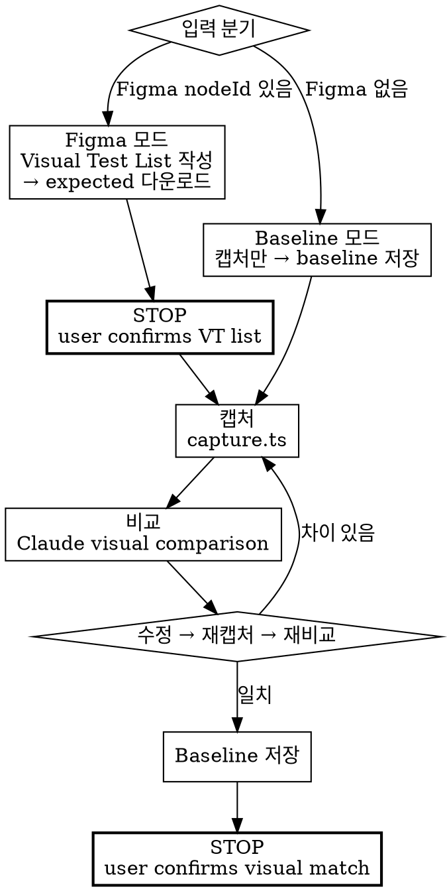

# Frontend Visual TDD

expected 이미지 확보 → 브라우저 캡처 → 비교 → iterate → baseline 저장.



## ABSOLUTE RULES

1. **Workflow B에서 Figma MCP를 사용하지 않는다.** 이미지 다운로드는 REST API(`figma-export.ts`), 비교는 Claude vision(로컬 파일). MCP 인라인 스크린샷은 파일로 저장할 수 없다.
2. **모든 VT 항목이 ✅가 될 때까지 완료 선언하지 않는다.**
3. **`diff.ts`는 Figma vs 브라우저 비교에 사용하지 않는다.** Font rendering, anti-aliasing 차이로 신뢰할 수 없다. `diff.ts`는 browser vs browser regression 전용이다.

### Rationalization Table — 이 생각이 들면 STOP

| 이런 생각이 들면 | 실제로 해야 할 것 |
|-----------------|------------------|
| "이 VT 항목은 중요하지 않으니 건너뛰자" | 모든 VT 항목을 처리한다. |
| "대충 비슷하니 통과시키자" | Claude visual comparison에서 차이를 지적하면 수정한다. |
| "Figma MCP 스크린샷으로 비교하면 편하겠다" | MCP 인라인 이미지는 파일로 저장 불가. REST API를 써라. |
| "diff.ts로 Figma랑 비교하면 되겠다" | Figma vs browser는 픽셀 비교 불가. Claude vision을 써라. |

## Setup

```bash
npm install -D playwright pixelmatch pngjs tsx
npx playwright install chromium --with-deps
```

## 입력 모드

| 모드 | 입력 | 동작 |
|------|------|------|
| **Figma** | fileKey, nodeId(들) | Visual Test List 작성 → expected 다운로드 → 캡처 → Figma 비교 → baseline |
| **Baseline** | 없음 (독립 트리거) | 현재 상태를 캡처 → baseline으로 저장 (regression 기준점) |

---

## Phase 5 — Download Expected Images (Figma 모드)

> Baseline 모드에서는 이 Phase를 건너뛰고 Phase 6의 캡처 단계로 간다.

### Step 1. Visual Test List 작성

Figma nodeId들로 Visual Test List를 작성한다 (nodeId당 최소 1개 VT 항목).
[references/figma-reference.md](references/figma-reference.md) §Visual Test List 참조.

### >>> STOP — Visual Test List를 user에게 제시하고 대기 <<<

> "Phase 5: Visual Test List — M개 Figma 노드에서 N개 visual test를 식별했습니다:
> [Visual Test List]
> 확인 후 다운로드를 시작할까요?"

**User 확인 전까지 이미지를 다운로드하지 않는다.**

### Step 2. expected 이미지 전부 다운로드

Visual Test List의 모든 nodeId를 `figma-export.ts`에 콤마 구분으로 전달한다.

```bash
export FIGMA_TOKEN=<TOKEN>
npx tsx scripts/figma-export.ts \
  --file-key <FILE_KEY> --node-ids <NODE_ID_1>,<NODE_ID_2>,... \
  --out visual-qa/expected --scale 1
```

[references/figma-reference.md](references/figma-reference.md)에서 nodeId 조회 및 scale 매칭 확인.

### Step 3. 다운로드 검증

모든 VT 항목에 expected 이미지가 존재하는지 확인 (`ls -la visual-qa/expected/`).
VT 항목별: ✅ 존재 / ❌ 누락. 전부 존재할 때까지 Phase 6으로 진행하지 않는다.
다운로드 실패 시 FIGMA_TOKEN과 nodeId 형식(colon: `123:456`)을 확인한다.

---

## Phase 6 — Visual Verification Loop

> Figma MCP 호출 없음. 모든 비교는 로컬 파일 + Claude vision.

### Step 1. Dev server 시작

```bash
npm run dev &
npx wait-on http://localhost:<PORT>
```

### Step 2–4. 각 VT 항목에 대해 — 캡처, 비교, iterate

**모든 VT 항목에 대해 Step 2–4를 반복한다.**
모든 항목이 완료될 때까지 STOP 게이트로 이동하지 않는다.

Progress tracking:
```
Visual Test Progress:
  VT-1: [label] — ⬜ pending
  VT-2: [label] — ⬜ pending
  ...
```
각 항목 완료 시: ⬜ → ✅ PASS 또는 ❌ FAIL (stall).
**모든 항목이 ✅이어야 Step 5로 진행 가능.**

**각 타겟에 대해:**

#### Step 2. 스크린샷 캡처

각 타겟은 다른 **브라우저 상태**를 요구할 수 있다 (토글 ON/OFF, 모달 열림/닫힘 등).
캡처 전 올바른 상태를 설정한다:

```bash
npx tsx scripts/capture.ts \
  --url  http://localhost:<PORT>/<route-or-preview> \
  --out  visual-qa/actual/<target-name>.png \
  --type <component|page|flow> \
  --width <W> --height <H>
```

Width/height는 Figma frame dimensions에 맞춘다.

#### Step 3. Figma와 비교 (Claude visual comparison — 로컬 파일만)

> **여기서 `diff.ts`를 절대 사용하지 않는다.** **Figma MCP를 절대 호출하지 않는다.**

두 **로컬** 이미지를 Claude에 제시한다:
1. `visual-qa/expected/<target-name>.png` (Phase 5에서 다운로드)
2. `visual-qa/actual/<target-name>.png` (방금 캡처)

Claude가 판단: 레이아웃, 간격, 색상, 타이포그래피, 전체 충실도.

#### Step 4. iterate

차이가 있으면:
- CSS/스타일 수정
- Hot reload 대기
- Step 2 재실행 (이 타겟만)
- Step 3 재비교

**타겟당 exit condition:** stall counter = 3 → user에게 escalate.

이 타겟 통과 시 done 표시하고 **다음 타겟**으로.

**중요: 남은 타겟을 건너뛰지 않는다. 모든 타겟이 visual GREEN이어야 Step 4-b로 진행.**

#### Step 4-b. 실제 라우트 검증 (접근 가능한 경우)

모든 preview 타겟 통과 후, 실제 프로덕션 라우트를 캡처하고 preview 스크린샷과 비교하여 drift를 감지한다.
[references/route-verification.md](references/route-verification.md) 참조.

### Step 5. Baseline 저장

모든 타겟이 visual verification 통과 시:
- 각 최종 actual 스크린샷이 **regression baseline**이 된다
- `visual-qa/expected/<target-name>-baseline.png`로 복사
- 이후 변경 시 `diff.ts` (pixelmatch)로 baseline과 비교
  (browser vs browser 비교는 신뢰 가능)

### >>> STOP — Visual Test 결과를 user에게 제시하고 대기 <<<

> "Phase 6 완료 — Visual Test List N/N 검증됨:
> ```
> VT-1: [label] — ✅ PASS
> VT-2: [label] — ✅ PASS
> ...
> ```
> 최종 확인해주세요."

<HARD-GATE>
모든 VT 항목이 ✅일 때까지 Phase 6 완료를 선언하지 않는다.
⬜ 또는 ❌인 항목이 있으면 아직 끝나지 않았다. 계속 처리한다.
</HARD-GATE>

## Baseline 모드 (Figma 없음)

Figma 없이 독립 트리거할 때:

1. Phase 5를 건너뛴다 (expected 이미지 없음)
2. Phase 6의 캡처 단계만 실행한다
3. 비교 단계를 건너뛴다 (비교 대상 없음)
4. 캡처한 스크린샷을 바로 baseline으로 저장한다

```bash
npx tsx scripts/capture.ts \
  --url http://localhost:<PORT>/<route> \
  --out visual-qa/expected/<name>-baseline.png \
  --type <component|page|flow> \
  --width <W> --height <H>
```

> "Baseline 캡처 완료. `visual-qa/expected/<name>-baseline.png`로 저장했습니다.
> 이후 regression 검사 시 이 baseline과 비교합니다."

## Gotchas

- **Figma MCP screenshots ≠ files.** `get_design_context`의 인라인 이미지는 디스크에 저장 불가.
  항상 `figma-export.ts` (REST API)로 이미지를 파일로 저장.
- **No pixel-diff for Figma vs browser.** Font rendering, anti-aliasing 차이로
  렌더링 엔진 간 픽셀 비교는 불가. Claude visual comparison 사용.
  `diff.ts`는 browser vs browser regression 전용.
- **Figma nodeId format.** URL `node-id=123-456` → API `123:456` (대시 → 콜론).
- **Stall counter = 3.** 3회 연속 진전 없으면 중단하고 escalate.

## CI Integration

[references/ci-guide.md](references/ci-guide.md)에서 CI 파이프라인 설정 참조.

## Checklist

- [ ] Visual Test List 작성 (Figma 모드) — **STOP, user 확인 대기**
- [ ] Expected 이미지 전부 다운로드 (Figma 모드)
- [ ] 다운로드 검증 — 모든 VT 항목에 expected 이미지 존재
- [ ] 각 VT 항목 캡처 (capture.ts)
- [ ] 각 VT 항목 Claude visual comparison (로컬 파일, MCP 아님)
- [ ] 모든 VT 항목 ✅ PASS
- [ ] 실제 라우트 vs preview 비교 (Step 4-b) — drift 검사 통과 — **STOP, user 확인 대기**
- [ ] Baseline 저장, artifacts 커밋
