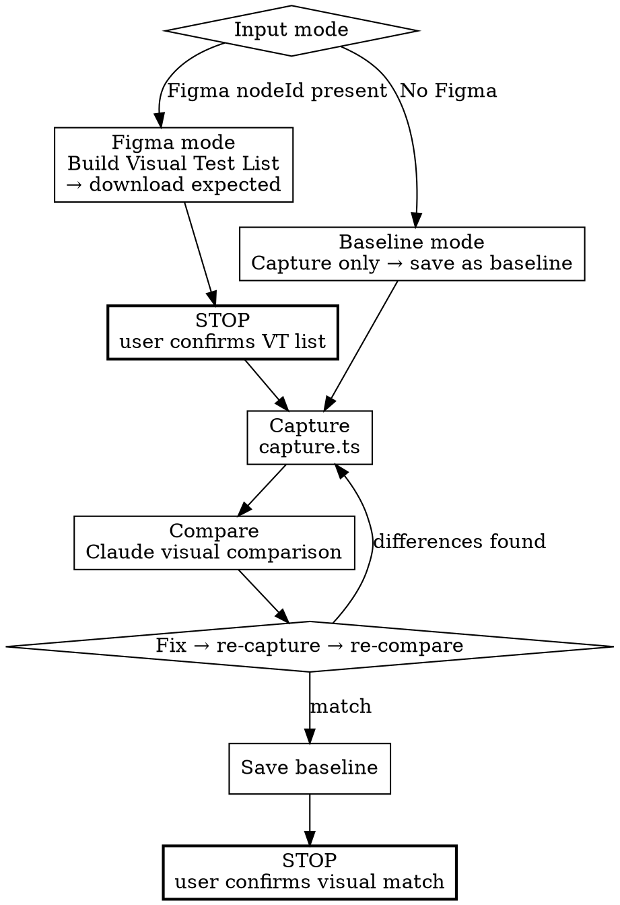

# Frontend Visual TDD

Obtain expected images → capture browser screenshots → compare → iterate → save baseline.



## ABSOLUTE RULES

1. **Do not use Figma MCP in Workflow B.** Image downloads use the REST API (`figma-export.ts`); comparisons use Claude vision (local files). MCP inline screenshots cannot be saved to disk.
2. **Do not declare completion until all VT items are ✅.**
3. **Do not use `diff.ts` for Figma vs browser comparison.** Font rendering and anti-aliasing differences make cross-engine pixel comparison unreliable. `diff.ts` is for browser vs browser regression only.

### Rationalization Table — If you think this, STOP

| If you think… | What you must do |
|----------------|-----------------|
| "This VT item isn't important, skip it" | Process all VT items. |
| "Close enough, let it pass" | If Claude visual comparison finds differences, fix them. |
| "Figma MCP screenshot would be easier to compare" | MCP inline images cannot be saved to files. Use the REST API. |
| "diff.ts can compare Figma against browser" | Figma vs browser pixel comparison is unreliable. Use Claude vision. |
| "PASS is enough, the user can open the images" | Fill every slot of the Step 3 verdict block. The block is the deliverable. |
| "It looks a few px off, I'll tweak the CSS and re-capture" | Measure first (`getBoundingClientRect` vs design spec). Iterate only on a measured `layout difference`. |

## Setup

```bash
npm install -D playwright pixelmatch pngjs tsx odiff-bin
npx playwright install chromium --with-deps
```

## Input Modes

| Mode | Input | Action |
|------|-------|--------|
| **Figma** | fileKey, nodeId(s) | Build Visual Test List → download expected → capture → compare with Figma → baseline |
| **Baseline** | None (independent trigger) | Capture current state → save as baseline (regression reference point) |

---

## Phase 5 — Download Expected Images (Figma Mode)

> In Baseline mode, skip this Phase and go to Phase 6's capture step.

### Step 1. Build Visual Test List

Build a Visual Test List from the Figma nodeIds (at least 1 VT item per nodeId).
See [references/figma-reference.md](references/figma-reference.md) §Visual Test List.

### >>> STOP — Present Visual Test List to user and wait <<<

> "Phase 5: Visual Test List — Identified N visual tests from M Figma nodes:
> [Visual Test List]
> Please confirm, then I'll start downloading."

**Do not download images until user confirms.**

### Step 2. Download all expected images

Pass all Visual Test List nodeIds to `figma-export.ts` as comma-separated values.

```bash
export FIGMA_TOKEN=<TOKEN>
npx tsx scripts/figma-export.ts \
  --file-key <FILE_KEY> --node-ids <NODE_ID_1>,<NODE_ID_2>,... \
  --out visual-qa/expected --scale 1
```

See [references/figma-reference.md](references/figma-reference.md) for nodeId lookup and scale matching.

### Step 3. Verify downloads

Confirm an expected image exists for every VT item (`ls -la visual-qa/expected/`).
Per VT item: ✅ present / ❌ missing. Do not proceed to Phase 6 until all are present.
On download failure, check FIGMA_TOKEN and nodeId format (colon: `123:456`).

---

## Phase 6 — Visual Verification Loop

> No Figma MCP calls. All comparisons use local files + Claude vision.

### Step 1. Start dev server

```bash
npm run dev &
npx wait-on http://localhost:<PORT>
```

### Step 2–4. For each VT item — capture, compare, iterate

**Repeat Steps 2–4 for every VT item.**
Do not move to the STOP gate until all items are complete.

Progress tracking:
```
Visual Test Progress:
  VT-1: [label] — ⬜ pending
  VT-2: [label] — ⬜ pending
  ...
```
On completion of each item: ⬜ → ✅ PASS or ❌ FAIL (stall).
**All items must be ✅ before proceeding to Step 5.**

**For each target:**

#### Step 2. Capture screenshot

Each target may require a different **browser state** (toggle ON/OFF, modal open/closed, etc.).
Set up the correct state before capturing:

```bash
npx tsx scripts/capture.ts \
  --url  http://localhost:<PORT>/<route-or-preview> \
  --out  visual-qa/actual/<target-name>.png \
  --type <component|page|flow> \
  --width <W> --height <H>
```

Width/height must match the Figma frame dimensions.

#### Step 3. Compare with Figma (Claude visual comparison — local files only)

> **Never use `diff.ts` here.** **Never call Figma MCP here.**

Present two **local** images to Claude:
1. `visual-qa/expected/<target-name>.png` (downloaded in Phase 5)
2. `visual-qa/actual/<target-name>.png` (just captured)

Claude evaluates: layout, spacing, colors, typography, overall fidelity.

**Record the verdict in this shape — every slot filled.** The user reviews this block instead of re-opening the images.

```
VT-<n>: <label> — PASS | FAIL
  expected: visual-qa/expected/<target-name>.png
  actual:   visual-qa/actual/<target-name>.png
  observed differences:
    1. <where> — <what> → rendering noise (anti-aliasing | font fallback | sub-pixel | dev overlay) | layout difference
       evidence: <why — e.g. "Figma text style is SpoqaHanSans, project font is Pretendard (design spec)">
    2. ...
  (or: observed differences: none)
```

Any `layout difference` → FAIL → Step 4. A PASS may carry only `rendering noise` items.

**If a position, size, or spacing difference is suspected but not certain, measure it before judging:**
- Browser: `page.evaluate(() => document.querySelector('<selector>').getBoundingClientRect())`
- Figma: the size/spacing value in the design spec (fe-spec collected it via `get_design_context`)
- Put both numbers in the `evidence` slot. Measured offset ≥ 2px → `layout difference`; 1px → `sub-pixel` rendering noise.

#### Step 4. Iterate

If the verdict block records any `layout difference`:
- Fix CSS/styles
- Wait for hot reload
- Re-run Step 2 (this target only)
- Re-compare in Step 3

**Per-target exit condition:** stall counter = 3 → escalate to user.

When this target passes, mark it done and move to the **next target**.

**Important: Do not skip remaining targets. All targets must be visual GREEN before proceeding to Step 4-b.**

#### Step 4-b. Actual route verification (if accessible)

After all preview targets pass, capture the actual production route and compare against the preview screenshot to detect drift.
See [references/route-verification.md](references/route-verification.md).

### Step 5. Save baseline

When all targets pass visual verification:
- Each final actual screenshot becomes the **regression baseline**
- Copy to `__baselines__/<route>/<target-name>.png` (see [references/ci-guide.md](references/ci-guide.md) §Baseline Path Convention)
- Future changes can use `diff.ts` to compare against baseline
  (browser vs browser comparison is reliable)

### >>> STOP — Present Visual Test results to user and wait <<<

> "Phase 6 complete — Visual Test List N/N verified:
> ```
> VT-1: [label] — ✅ PASS
>   expected: ... / actual: ...
>   observed differences: <Step 3 verdict block, or none>
> VT-2: [label] — ✅ PASS
>   ...
> ```
> Baselines saved under `__baselines__/<route>/`.
> Please confirm."

<HARD-GATE>
Do not declare Phase 6 complete until all VT items are ✅.
If any item is ⬜ or ❌, it is not done yet. Keep processing.
</HARD-GATE>

## Baseline Mode (No Figma)

When triggered independently without Figma:

1. Skip Phase 5 (no expected images)
2. Run only the capture step from Phase 6
3. Skip the comparison step (nothing to compare against)
4. Save the captured screenshot directly as baseline

```bash
npx tsx scripts/capture.ts \
  --url http://localhost:<PORT>/<route> \
  --out __baselines__/<route>/<name>.png \
  --type <component|page|flow> \
  --width <W> --height <H>
```

> "Baseline capture complete. Saved to `__baselines__/<route>/<name>.png`.
> Future regression checks will compare against this baseline."

## Gotchas

- **Figma MCP screenshots ≠ files.** `get_design_context` inline images cannot be saved to disk.
  Always use `figma-export.ts` (REST API) to save images as files.
- **No pixel-diff for Figma vs browser.** Font rendering and anti-aliasing differences make
  cross-engine pixel comparison unreliable. Use Claude visual comparison.
  `diff.ts` is for browser vs browser regression only.
- **Figma nodeId format.** URL `node-id=123-456` → API `123:456` (dash → colon).
- **Stall counter = 3.** 3 consecutive iterations with no progress → stop and escalate.
- **Deterministic mode** is on by default in `capture.ts` (`--deterministic true`).
  It freezes `Date.now()`, seeds `Math.random()`, disables CSS animations, and makes `requestAnimationFrame` synchronous.
  Disable with `--deterministic false` if the page relies on real timing.
- **Stability wait** is on by default (`--stability-wait true`).
  It waits for font loading, DOM settle (300ms), animation completion, and network idle before each screenshot.
  Disable with `--stability-wait false` if you handle wait logic yourself.

## CI Integration

See [references/ci-guide.md](references/ci-guide.md) for CI pipeline setup.

## Checklist

- [ ] Visual Test List built (Figma mode) — **STOP, wait for user confirmation**
- [ ] All expected images downloaded (Figma mode)
- [ ] Downloads verified — expected image exists for every VT item
- [ ] Each VT item captured (capture.ts)
- [ ] Each VT item compared via Claude visual comparison (local files, not MCP)
- [ ] Each VT item's verdict block recorded — paths, observed differences, evidence
- [ ] Suspected position/size/spacing differences measured (`getBoundingClientRect` vs design spec), not eyeballed
- [ ] All VT items ✅ PASS
- [ ] Actual route vs preview comparison (Step 4-b) — drift check passed — **STOP, wait for user confirmation**
- [ ] Baseline saved, artifacts committed
